# Task 7.2 – Linux Commands
For this task, basic Linux commands where implemented on Ubuntu, this README documents the process.

List of operations performed:  
1. Print working directory
2. List contents of a directory
3. Change directory
4. Edit text files
5. Copy/Move files between directories
6. View contents of text files
7. Deleting files/directories.

## Print working directory

The Linux terminal launches with the `/home/ubuntu` (and denoted with the tilde `~` symbol) as the working directory. This is demonstrated using the `pwd` command below.

## List directory contents

Now, we know where the working directory is, the contents can be viewed using `ls` command.

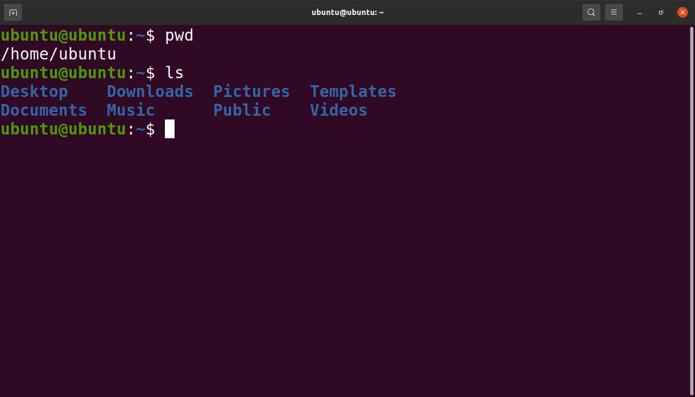

## Change working directory

Let's focus on the **Documents** folder, we do so by typing ` cd Documents `.  
Inside **Documents**, ` ls `, reveales a folder named **micro**.  
Changing the directory again using ` cd micro `, then viewing its contents using ` ls `,

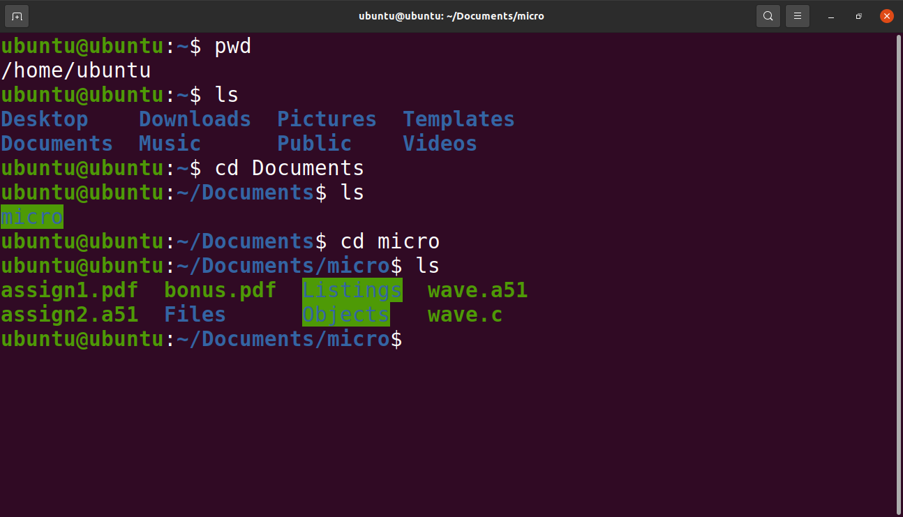

## Editing files
Inside **micro**, a C-code file named `wave.c`  needs some edits.
Using `nano wave.c` open the file using **GNU nano**.

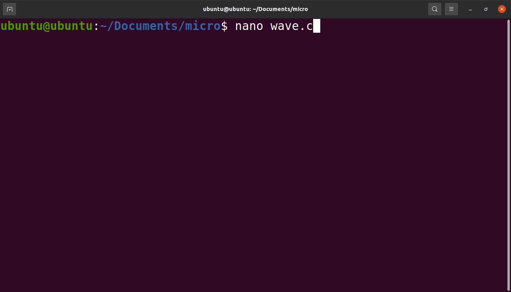

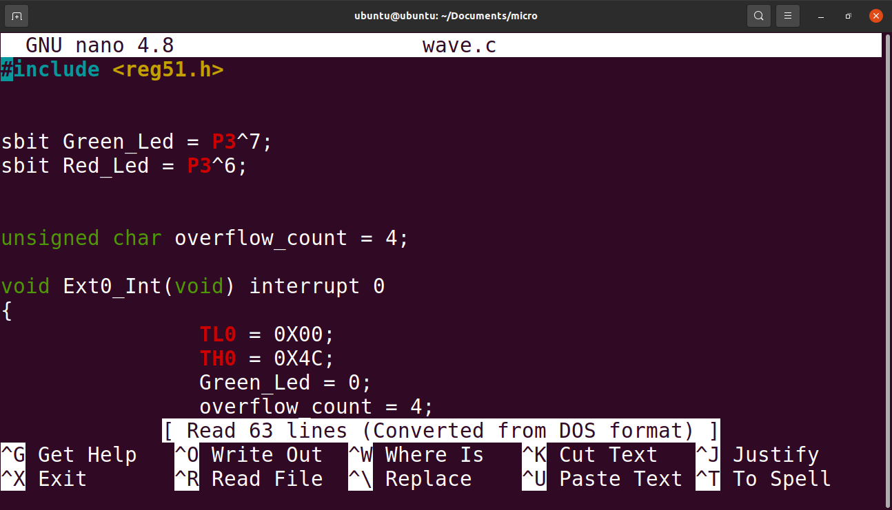

To save and exit the the code editor, we press  **Ctrl+X**.

## Creating a new directory

To return to the **Documents** directory, ` cd .. ` automatically moves up one level.  
A new folder **test-dir** is created using ` mkdir test-dir ` and this is confirmed by ` ls ` shows the folder just created.

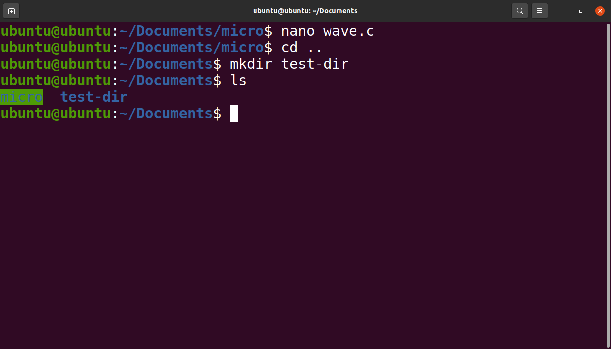

## Copying files

The `wave.c` file edited earlier can be copied to the new directory using  
`` cp micro/wave.c test-dir/wave_copy.c ``  
A `_copy` suffix is added to distinguish the new file.  

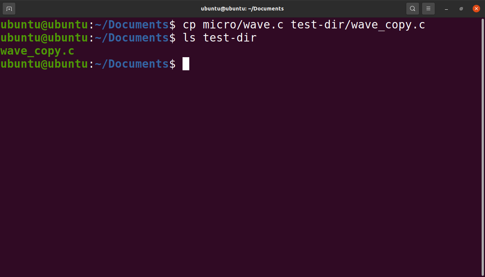

Using ` ls test-dir ` shows that the file is indeed copied.

## Creating a new file.

To create a simple text file, the command `touch test.txt` is used.

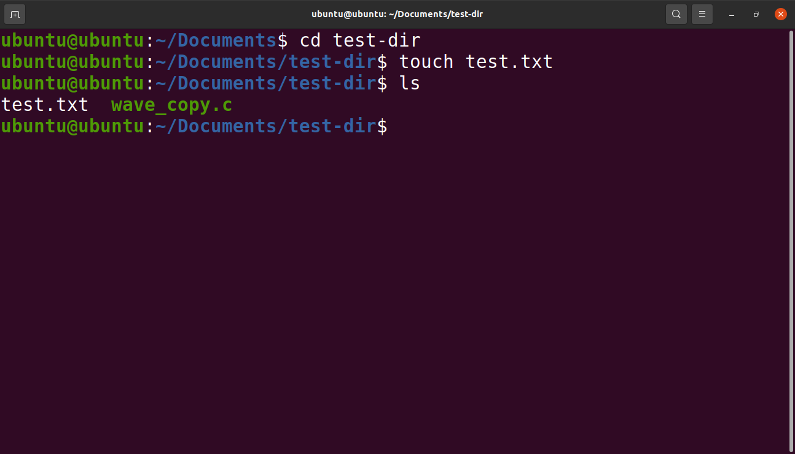

Writing text to this file using **GNU nano** by typing ` nano test.txt `  

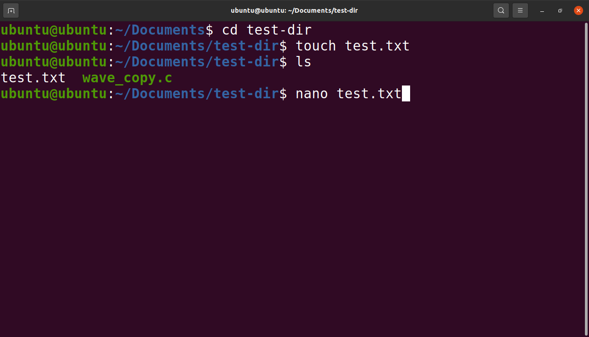

Which opens the blank file in the text editor, where a string of text is typed.  

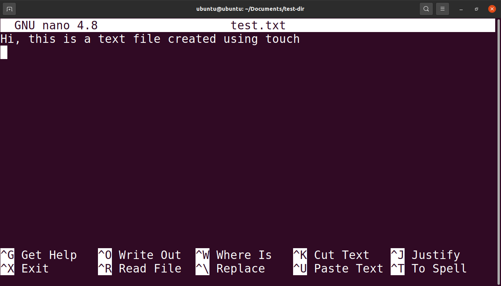

## Moving files between directories
The `test.txt` file just created needs to be moved to **micro** folder (*i just made this up* 🤷‍♂️).  
Using `cd ..` to change directory to **Documents**, then similarly to copying, the file is moved using  
`` mv test-dir/test.txt micro/text_m.txt ``

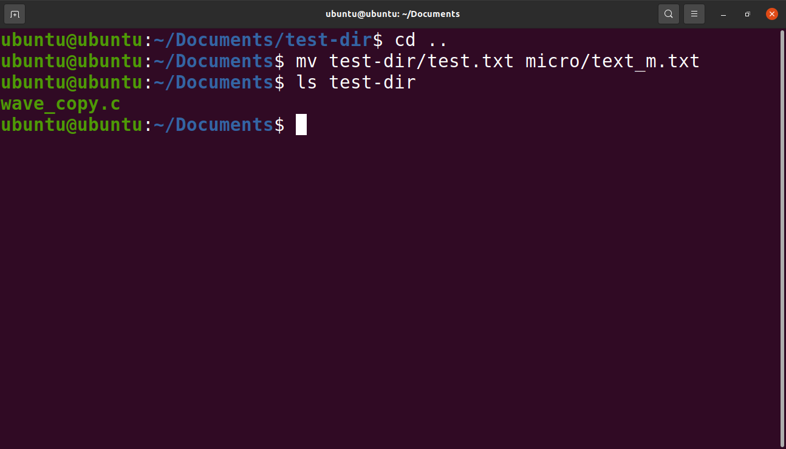

Viewing the contents of **micro** using `ls` shows the file is indeed moved.

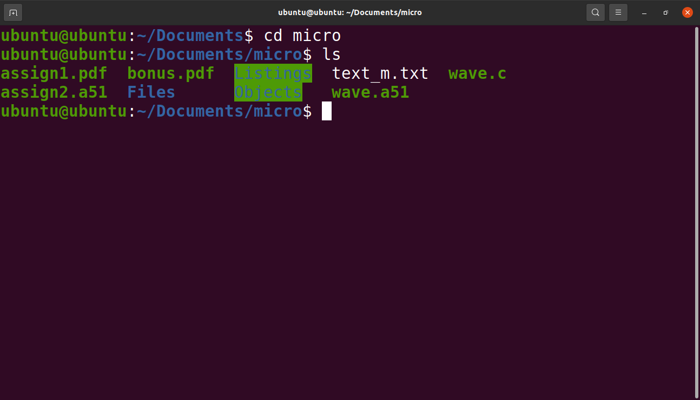

## Viewing text files

To ensure the file was moved without modifications, the contents of the file can be viewed using the `cat` command (short for *concatenate*). 

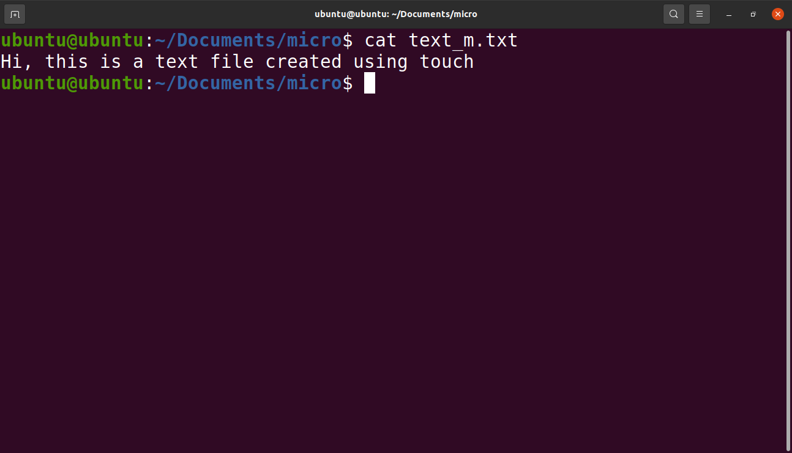

## Deleting directories

The **test-dir** folder created earlier has saved its purpose of demonstrating Linux commands, and its time has come.🔪  
The ` rm ` command is used for deleting files, and when used with the `-r` option, it can also delete entire folders/directories.

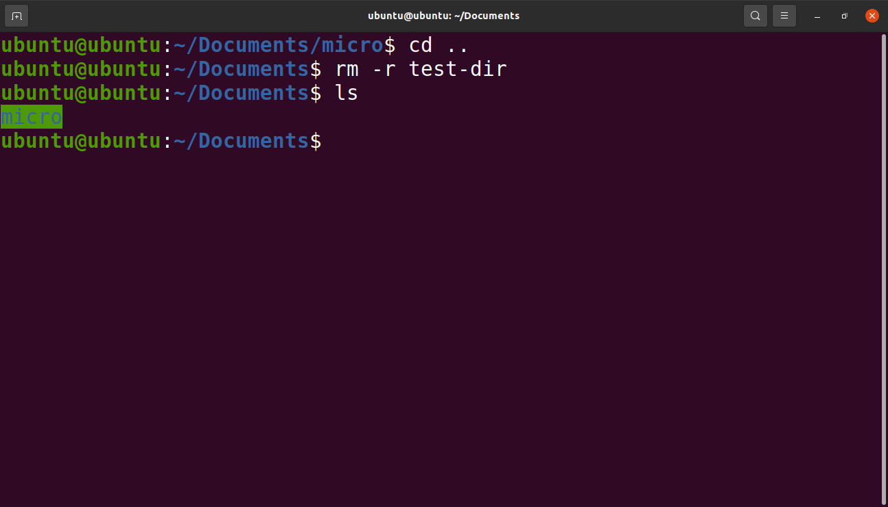

Finally, checking contents of **Documents** shows no traces of the **test-dir** folder.